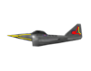
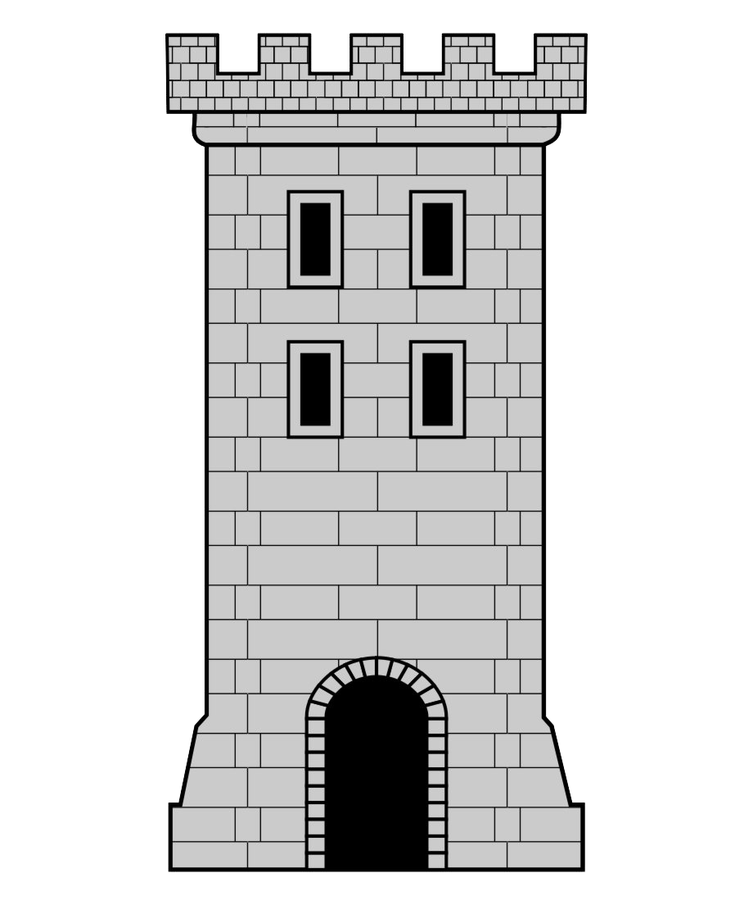

# 🛩️ Bomber! (JavaFX 2D Shooter)

**Bomber!** is a dynamic 2D arcade game developed in Java using the JavaFX framework. The player controls a fighter plane, dodges enemy fire, and destroys both ground and air targets to achieve the highest possible score.

## 📸 Game Assets & Screenshots
The game utilizes custom sprites located in `src/main/resources/com/example/game/images/`. Here are some of the core assets used in the game:

| Player Plane | Enemy Plane | Ground Tower |
| :---: | :---: | :---: |
|  |  |  |

*(Note: Add an actual gameplay screenshot here using `` to make the repository more engaging).*

## 🌟 Features
* **Dual Attack System:** Horizontal shooting to take down enemy planes and vertical bombing to destroy ground towers.
* **Dynamic Environment:** Infinite scrolling background (parallax effect) that creates a smooth illusion of flight.
* **Enemy AI:** Enemy planes actively return fire at random intervals, keeping the gameplay challenging.
* **State Management:** Full support for pausing the game (stopping all timers and animations) and Game Over logic.

## 🎮 Controls
Controlling the plane is intuitive and relies on the keyboard:

* **`W` / `A` / `S` / `D`** — Move the plane (Up, Left, Down, Right).
* **`SHIFT`** — Accelerate (Turbo mode).
* **`SPACE`** — Shoot forward (target enemy planes).
* **`C`** — Drop a bomb vertically (target ground towers).
* **`ESC`** — Pause / Resume the game.

## 🛠️ Technology Stack
* **Programming Language:** Java (JDK 11 or higher recommended)
* **GUI Framework:** JavaFX (`AnimationTimer`, `TranslateTransition`, `ParallelTransition`)
* **UI Markup:** FXML (`hello-view.fxml`)

